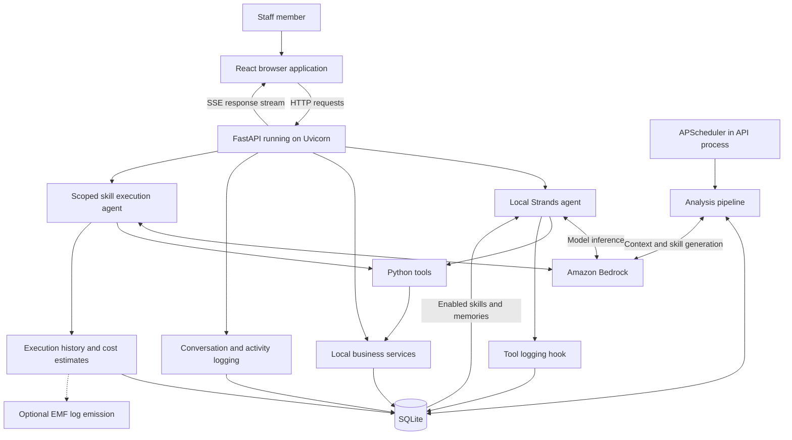

# MediFlow: project explanation and detailed study guide

This guide explains the source in this directory as inspected on September 11, 2026. File links are relative to this guide. Package versions below are declared constraints, not a report of installed versions. Setup and exercises are instructions for the learner; no AWS resources were deployed or model calls made while preparing this document.

MediFlow is a demonstration of an AI-assisted medical reception desk. Staff can inspect patient records, manage appointments and doctor availability, record invoice payments, simulate messages, and ask an agent to perform tasks. It also analyzes previous activity to propose reusable skills and patient memories.

The main learning opportunity is understanding how a web application connects a language model to ordinary business functions, records the results, and uses that evidence to improve subsequent behavior.

## 1. Architecture and service inventory



An arrow to Bedrock represents a remote model request. The agent, tools, database, scheduler, and HTTP server run in the local application process or environment.

| Component | Actual role | Required? |
|---|---|---|
| Amazon Bedrock | Model inference for chat, analysis, memory extraction, batch resolution, and skill execution | For AI features |
| AWS credentials and IAM permissions | Authenticate and authorize Bedrock requests | For AI features |
| Strands Agents SDK | Runs the model/tool loop inside Python | Backend dependency |
| FastAPI and Uvicorn | API routing, validation, streaming, static frontend serving | Yes |
| SQLite | Stores business data and learning/execution records | Yes |
| React, Vite, Tailwind | Browser interface and frontend build | For UI |
| APScheduler | Recurring analysis pipeline job | Started by backend |
| CloudWatch EMF support | Formats optional execution metrics as logs | Optional; collection infrastructure absent |
| Docker and Compose | Alternative packaging and persistent database volume | Optional |

There is no implementation here of S3 storage, DynamoDB, RDS, Lambda, API Gateway, SageMaker training, Bedrock Knowledge Bases, managed Bedrock Agents, AgentCore, OpenSearch, SNS, SES, or an external payment processor. Learning those products is not a prerequisite for understanding this example.

The files under `backend/services/` are Python modules, not independently deployed microservices. Appointment reminders and payment chases create local communication records. A `sent` database status does not prove an SMS or email was delivered.

## 2. Read the code in this order

| Order | Source | What to learn |
|---|---|---|
| 1 | [pyproject.toml](pyproject.toml), [package.json](frontend/package.json), [config.py](backend/config.py) | Dependencies and configuration |
| 2 | [main.py](backend/main.py) | Startup, routers, static files, shutdown |
| 3 | [database.py](backend/services/database.py) | Schema, connections, migrations |
| 4 | [patient_service.py](backend/services/patient_service.py), [calendar_service.py](backend/services/calendar_service.py) | Business operations without AI |
| 5 | [patient_tools.py](backend/tools/patient_tools.py), [calendar_tools.py](backend/tools/calendar_tools.py) | Exposing functions to the agent |
| 6 | [agent.py](backend/agent/agent.py), [prompts.py](backend/agent/prompts.py) | Agent construction and context |
| 7 | [chat_routes.py](backend/api/chat_routes.py), [client.js](frontend/src/api/client.js) | End-to-end streaming |
| 8 | [orchestrator.py](backend/analysis/orchestrator.py) and the other analysis modules | Learning pipeline |
| 9 | [skill_routes.py](backend/api/skill_routes.py), [skill_executor.py](backend/agent/skill_executor.py) | Review and execution |
| 10 | [tests](tests) | Expected behavior and edge cases |

## 3. Dependency guide

### Python dependencies

Python must satisfy `>=3.11`; the Dockerfile uses Python 3.12.

| Dependency | Declared constraint | Purpose and study focus |
|---|---|---|
| `fastapi` | `>=0.115.0` | Defines HTTP endpoints and application lifecycle. Learn routers, request models, response codes, sync versus async handlers. |
| `uvicorn[standard]` | `>=0.30.0` | ASGI server that runs FastAPI. Learn host binding, ports, reload, and worker processes. The extra installs additional server support packages. |
| `strands-agents` | `>=0.1.0` | Supplies `Agent`, `BedrockModel`, tool decorators, hooks, and streaming. Learn the iterative model/tool cycle. |
| `strands-agents-builder` | `>=0.1.0` | Declared dependency; no direct import was found in the inspected backend. Do not assume it generates the application's skills: `automation_generator.py` uses ordinary Strands agents. |
| `sse-starlette` | `>=2.0.0` | `EventSourceResponse` converts async event generators into SSE responses. |
| `pydantic` | `>=2.0.0` | Validates typed request bodies. Learn what field typing catches and what requires business validation. |
| `pydantic-settings` | `>=2.0.0` | Loads configuration from environment variables and `.env`. |
| `apscheduler` | `>=3.10.0` | Supplies `AsyncIOScheduler` and `CronTrigger`. Code uses the 3.x-style API; the constraint does not exclude future incompatible major versions. |
| `pytest` | `>=8.0.0`, dev extra | Test fixtures, assertions, temporary data, monkeypatching. |
| `pytest-asyncio` | `>=0.24.0`, dev extra | Supports async tests. |
| `httpx` | `>=0.27.0`, dev extra | HTTP client support used for API testing. |
| `hatchling` | Build requirement | Builds the Python distribution with the `backend` package. |

`sqlite3`, `asyncio`, `logging`, `json`, `datetime`, `uuid`, and `pathlib` belong to Python's standard library. Do not install a separate SQLite Python package for this code.

AWS SDK support comes through the model-provider dependency chain rather than a direct `boto3` declaration in this project's manifest. Inspect the installed dependency tree before making assumptions about exact SDK versions.

There is no Python lockfile in this directory. Lower bounds allow different installations to resolve different versions. `pip check` checks declared dependency compatibility; it does not establish application behavior. For reproducible experiments, save the resolved versions in your own learning environment.

### Frontend dependencies

| Dependency | Declared constraint | Purpose |
|---|---|---|
| `react`, `react-dom` | `^18.3.1` | Components, hooks, context, and rendering into the DOM |
| `lucide-react` | `^0.468.0` | UI icon components |
| `react-markdown` | `^10.1.0` | Renders agent Markdown responses |
| `remark-gfm` | `^4.0.1` | Adds GitHub-style Markdown features such as tables |
| `vite` | `^6.0.5` | Development server and frontend bundle build |
| `@vitejs/plugin-react` | `^4.3.4` | React integration for Vite |
| `tailwindcss`, `@tailwindcss/vite` | `^4.1.3` | Utility styling and Vite CSS integration |
| `@types/react` | `^18.3.18` | React type information for tooling |
| `@types/react-dom` | `^18.3.5` | React DOM type information for tooling |

The source is JavaScript/JSX. Type packages do not mean a TypeScript compiler is configured. `package-lock.json` captures the frontend resolution; `npm ci` uses it. React Router, Redux, Axios, and a charting package are not declared: inspect the app context, native `fetch`, and local chart components instead of assuming those libraries are used.

## 4. Study Amazon Bedrock and AWS access

**Concept.** Bedrock supplies remote foundation-model inference. MediFlow sends prompts and tool definitions, receives text or tool-use requests, runs selected Python functions locally, and returns results to the model through Strands.

**Where it appears.** Search for `BedrockModel` in `backend/`. It is constructed in the receptionist agent, context extractor, automation generator, batch resolver, skill executor, and conversation-memory extractor.

The checked-in defaults are:

```dotenv
AWS_DEFAULT_REGION=us-east-1
BEDROCK_MODEL_ID=us.anthropic.claude-sonnet-4-20250514-v1:0
```

These are repository defaults, not a guarantee that your account can invoke that target today. An inference profile can be supplied as the model invocation target; cross-region routing also means the client region is not necessarily the processing region. Consult the [Bedrock inference-profile documentation](https://docs.aws.amazon.com/bedrock/latest/userguide/inference-profiles-use.html).

**Learn these terms:** token, context window, inference, model ID, inference profile, streaming, tool use, latency, throttling, input cost, output cost.

**Request trace:** “Find a patient and list their appointments” becomes a prompt with tool definitions. The model can request `search_patients`, inspect its returned IDs, then request `get_patient_history`. Python reads SQLite; the model receives the result and writes a response. Bedrock is not directly connecting to SQLite.

**AWS access.** The runtime needs credentials and permission to invoke its chosen model/profile. Streaming inference requires the corresponding streaming permission. Scope permissions to the intended targets and account setup; use the [Bedrock invocation documentation](https://docs.aws.amazon.com/bedrock/latest/userguide/inference-api.html) when diagnosing access. The repository does not supply an IAM policy or provisioning template.

With an already configured AWS CLI profile, a learner can check identity with:

```powershell
aws sts get-caller-identity --profile your-profile
$env:AWS_PROFILE = 'your-profile'
```

The identity command uses STS as a diagnostic; it is not an additional application integration. A successful identity lookup proves credentials work, not that Bedrock invocation is authorized. A host profile is not automatically available inside the Compose container.

**Exercise:** locate every `BedrockModel` construction and label its task. Explain why a single chat interaction can lead to several inference requests and a later memory-extraction request.

**Checkpoint:** distinguish a local Strands agent from a managed Bedrock Agent. Explain why a valid model ID, usable credentials, permissions, and region/profile compatibility are separate requirements.

## 5. Study Strands and tool calling

Start at [agent.py](backend/agent/agent.py). `create_agent()` constructs a model, formats a system prompt, selects tools, attaches an optional logging hook, and returns an `Agent`.

The prompt can include today's date, a 14-day weekday/date lookup, selected UI view, the last 20 supplied conversation turns, enabled nonscheduled skills, and patient memories. The date lookup reduces ambiguity in requests such as “next Thursday.”

The base `ALL_TOOLS` list contains **38 entries** in this snapshot. The separate registry contains **30 entries**, including two patient-memory tools that can be added through enabled skills. The registry and the chat tool list serve different purposes: the former resolves stored skill tool names; the latter defines default chat capabilities.

| Tool group | Examples | What to inspect |
|---|---|---|
| Calendar | `check_availability`, `book_appointment`, `reschedule_all_patients_for_doctor` | Availability checks and cascades |
| Patient | `search_patients`, `get_patient_history`, `update_patient_notes` | Entity identity and updates |
| Billing | `get_invoice`, `record_payment`, `send_payment_reminder` | Financial record state |
| Communications | `send_message`, `send_appointment_reminder` | Simulated outbound messages |
| Practice and briefing | `get_practice_info`, `get_doctor_schedule`, `check_pathology_results` | Read-oriented summaries |
| Skills | `get_pending_skills`, `enable_skill` | Stored behavior activation |
| UI | `navigate_to_view`, `show_patient_tab`, `stage_skill_approval` | Structured UI actions |

A decorated function exposes its name, description, and typed parameters to the framework. Descriptions influence model selection; the actual function implementation determines effects. See the [Strands Python quickstart](https://strandsagents.com/docs/user-guide/quickstart/python/) for the framework pattern.

Generated skills do not install arbitrary new Python functions. Stored `tool_config` names are resolved against `TOOL_REGISTRY`. The skill executor creates an agent with that subset of tools. This limits available capabilities, but a prompt instruction is still not a database constraint or authorization rule.

**Exercise:** trace `send_appointment_reminder` from decorator to service to SQL. Record required arguments, reads, writes, result shape, and failure paths. Then trace a UI navigation tool and compare its effects.

**Checkpoint:** explain why successful language generation is not proof of a successful business operation. Check actual tool results and persisted changes.

## 6. Study FastAPI, Uvicorn, Pydantic, and SSE

[main.py](backend/main.py) assembles nine routers, initializes the database at startup, starts APScheduler, stops it at shutdown, and serves built frontend assets when present. `/health` simply returns `{"status":"ok"}`; it does not test Bedrock, credentials, or database transactions.

| API family | Purpose |
|---|---|
| `/api/chat`, `/api/chat/sync` | Streamed and nonstreamed chat |
| `/api/data/...` | Today dashboard, calendar, patients, practitioners, and mutations |
| `/api/dashboard/summary` | Summary data |
| Session routes | Stored conversation/session retrieval |
| `/api/activity` | Browser interaction records |
| Memory routes | Patient-memory review and maintenance |
| `/api/analysis/...` | Run, inspect, cancel, and configure analysis |
| `/api/skills/...` | Inspect, test, enable, stage, approve, execute, and inspect history |
| `/api/metrics/...` | Execution and estimated-cost summaries |

Use the running application's `/docs` for complete route names and schemas.

**Streaming trace:** the browser POSTs a JSON body to `/api/chat`. FastAPI validates it as `ChatMessage`, logs the user turn, loads enabled skills, and constructs an agent. `agent.stream_async()` yields events. The route transforms them into `text_delta`, `tool_call`, `ui_action`, `message`, `done`, or `error` SSE events. The frontend reads `response.body` and dispatches events to update the UI.

SSE is a server-to-browser stream over HTTP; it is not a bidirectional WebSocket. This client uses streaming `fetch` because it sends a POST body, rather than using the browser's native `EventSource` interface.

After `done`, the streaming route attempts patient-memory extraction in an executor. The synchronous route does not implement that same extraction tail. Client-displayed completion and completion of all backend work are therefore different moments.

**Concurrency:** awaiting a network operation can let the server handle other work. Synchronous model calls moved to `run_in_executor` execute in threads. Ordinary SQLite functions remain synchronous. Adding `async` to a function does not make every call inside it nonblocking.

**Exercise:** use browser developer tools to inspect one chat response. Match each event name to the server `yield` and frontend handler. As an advanced exercise, test SSE parsing when `event:` and `data:` arrive in different network chunks: `currentEvent` is recreated inside each read iteration in the current client.

**Checkpoint:** distinguish request validation, HTTP status errors, errors inside an already-started stream, and domain errors returned by tools.

## 7. Study SQLite and the data model

[database.py](backend/services/database.py) opens a connection per helper call, enables foreign keys, converts query rows to dictionaries, commits writes, and closes connections. `init_db()` creates tables and performs selected additive migrations.

| Table group | Tables | Learning purpose |
|---|---|---|
| Practice data | `doctors`, `patients`, `appointments`, `invoices`, `practice_info` | Entities and relationships |
| Operational context | `communications`, `doctor_unavailability`, `pathology_results` | Actions and exceptions |
| Evidence | `tool_call_log`, `conversation_log`, `ui_activity_log` | Observing agent and human behavior |
| Learned artifacts | `detected_patterns`, `patient_memories`, `skills` | Persisted behavioral adaptation |
| Execution records | `skill_executions`, `skill_execution_items` | Run-level and item-level outcomes |
| Pipeline control | `pipeline_state`, `pipeline_runs` | Configuration, progress, and history |

There are 18 `CREATE TABLE` declarations. Appointments link patients and doctors. Invoices and communications refer to patients. Skills can reference detected patterns. Execution items reference execution runs.

Some fields contain JSON encoded as text: tool arguments, tool configuration, cached batch items, and other metadata. Learn the boundary between a relational relationship and a serialized list that SQLite does not validate structurally.

Parameterized SQL such as `WHERE patient_id = ?` keeps values separate from SQL syntax. `execute_db()` commits each call independently: two calls are not one atomic transaction. For example, inserting a reminder and updating the appointment flag could partially complete if the second write fails.

**Read-only exercise:** run these statements against your disposable study database using a SQLite viewer:

```sql
SELECT a.id, p.first_name, p.last_name, d.name, a.date, a.time, a.status
FROM appointments a
JOIN patients p ON p.id = a.patient_id
JOIN doctors d ON d.id = a.doctor_id
ORDER BY a.date, a.time;

SELECT session_id, tool_name, success, COUNT(*) AS calls
FROM tool_call_log
GROUP BY session_id, tool_name, success;

SELECT name, status, scheduled, tool_config FROM skills;
```

**Checkpoint:** explain foreign keys, transactions, indexes, and why multiple workers sharing this database and scheduler need more design work than changing a server flag. Consult [Python's sqlite3 documentation](https://docs.python.org/3/library/sqlite3.html) for further study.

## 8. Study every internal service

### Calendar service

**Source:** [calendar_service.py](backend/services/calendar_service.py).

Manages slots, booking, rescheduling, cancellation, doctor exceptions, conflicts, and bulk rescheduling. Availability derives from working days, hours, consultation duration, existing bookings, and unavailability exceptions. Exceptions override the base schedule.

**Learn:** interval overlap, date handling, state transitions, and transactional constraints. Follow `check_availability()` into `_slot_blocked_by_unavailability()`, then compare checks performed by booking and rescheduling rather than assuming every mutation enforces identical rules.

**Lab:** with test fixtures, block a doctor's morning and compare morning and afternoon availability. Trace affected appointments and the bulk rescheduling result. Study [test_doctor_availability.py](tests/test_doctor_availability.py).

**Question:** what happens if two requests select the same free slot before either commits?

### Patient service

**Source:** [patient_service.py](backend/services/patient_service.py).

Search splits a name query into tokens and requires every token to match the concatenated full name. History returns a patient plus recent appointments and invoices, each limited to 20 records. Updating notes appends rather than replaces text.

**Learn:** identifiers versus names, joins, search semantics, and bounded results. A surname match in chat context is a heuristic, not a guarantee of unique identity.

**Lab:** compare first-name, surname, full-name, empty, and unknown-patient queries. Append a note twice and inspect the result.

**Question:** why should a model carry a verified patient ID into later tool calls?

### Billing service

**Source:** [billing_service.py](backend/services/billing_service.py).

Lists outstanding invoices, loads one invoice, records a payment, and creates payment-chase communications. `record_payment()` adds the amount to `amount_paid` and marks the invoice paid when the cumulative value reaches the invoice amount. Payment chases update counters and timestamps and insert a communication.

**Learn:** cumulative balances, read-modify-write races, currency representation, and idempotency. These functions update accounting records; they do not charge a card or transfer money.

**Lab:** use temporary data for partial and full payment examples. Inspect what validation exists for zero, negative, repeated, and excessive amounts before assuming those cases are blocked.

**Question:** how would a retried request avoid recording the same payment twice?

### Communications service

**Source:** [comms_service.py](backend/services/comms_service.py).

Creates appointment reminders and general messages, choosing the patient's preferred channel when appropriate. Reminder creation also updates `reminder_sent`. History is ordered by send timestamp.

**Learn:** simulated versus external side effects, delivery state, retries, and consistency between related writes.

**Lab:** record a reminder and inspect both `communications` and `appointments`. Repeat the call in disposable data and determine whether the service itself prevents duplicates.

**Question:** if a real provider were added, would “accepted by provider,” “delivered,” and “read” be the same state?

### Audit service

**Source:** [audit_service.py](backend/services/audit_service.py) and [tool_logging_hook.py](backend/agent/tool_logging_hook.py).

Stores conversation turns and tool calls with session correlation and ordering. Tool records capture parameters, summarized results, duration, and success/error information. These records are evidence for analysis, not merely debugging text.

**Learn:** session IDs, ordering, hook callbacks, and outcome attribution. Tool invocation events shown to the UI are not a substitute for completed-tool audit records.

**Lab:** reconstruct one conversation from its tool-call and conversation tables. Identify the difference between an attempted action and an action reported as successful.

**Question:** could concurrent calls produce ambiguous sequence numbers, and what database constraint or allocation mechanism would help?

### Activity service

**Source:** [activity_service.py](backend/services/activity_service.py) and [useActivityTracker.js](frontend/src/hooks/useActivityTracker.js).

The browser batches events and sends them to `/api/activity`; the service persists action type, entity, view, duration, and detail. Analysis can learn from manual UI operations as well as agent tools.

**Learn:** batching, event schemas, loss tolerance, and event interpretation. A view navigation is evidence of attention, not proof that a business mutation occurred.

**Lab:** open a patient view and perform one manual action. Compare the activity records with any resulting business rows.

**Question:** what evidence distinguishes repeated navigation from repeated useful work?

### Memory service

**Source:** [memory_service.py](backend/services/memory_service.py).

There are three paths: LLM extraction after streamed conversations, deterministic behavioral detection during analysis, and staff review through the API. Memory rows track patient, type, content, source, confidence, observation count, and status.

Conversation extraction first checks tool parameters for patient references. It asks a model for a JSON array, validates that referenced patients exist, and merges or inserts memories. Deduplication uses word-set overlap greater than 0.6. Repeated matches increase the observation count and adjust confidence.

**Learn:** persistent context, provenance, heuristic confidence, and deduplication. This is SQL-backed memory without embeddings or vector search. A confidence number here is not a calibrated statistical probability.

**Lab:** add two similarly worded preferences to temporary data and inspect merging. Compare `get_memories()` with `get_memories_for_context()`.

**Question:** why might repeatedly analyzing the same evidence inflate confidence? Also inspect the chat gate: automatic patient-context injection only occurs when an enabled nonscheduled skill references `get_patient_memories`.

### Execution-history service

**Source:** [execution_history.py](backend/services/execution_history.py).

Records skill-run lifecycle and individual item outcomes, and supports aggregate reporting. This lets the UI inspect what happened after an execution stream has finished.

**Learn:** run-level versus item-level status, timing, errors, and durable progress. Read the executor's event interpretation before treating every success counter as a verified database postcondition.

**Lab:** inspect an existing run and its items. Explain whether one failed item should make the entire batch fail, partially succeed, or continue.

**Question:** what terminal record should remain if agent construction fails after a run record has been created?

### Pricing service

**Source:** [pricing.py](backend/services/pricing.py).

Estimates cost as `input_tokens * input_rate / 1,000,000 + output_tokens * output_rate / 1,000,000`. The code contains $3 input and $15 output per million tokens for two model IDs and also uses those numbers as its fallback.

These are hard-coded application assumptions, not verified current AWS prices. For example, using those assumptions, 2,000 input and 500 output tokens gives $0.0135. Changing model ID without updating rates can produce a misleading estimate. Skill metrics also do not necessarily account for every chat, extraction, or resolver request.

**Lab:** compute a sample estimate by hand and compare it with `estimate_cost()`. Explain the unknown-model fallback.

**Question:** why is an application estimate different from an AWS billing total? Check [Bedrock pricing](https://aws.amazon.com/bedrock/pricing/) before budgeting a real run.

### CloudWatch metrics helper

**Source:** [cloudwatch.py](backend/services/cloudwatch.py).

Disabled by default. `CLOUDWATCH_METRICS_ENABLED=true` enables JSON log payloads with namespace `MediFlow/SkillExecution`, dimensions `SkillId` and `Trigger`, and duration, token, estimated-cost, and success metrics.

The helper does not call CloudWatch APIs. CloudWatch extracts EMF metrics from appropriately structured logs that actually reach CloudWatch Logs; this Compose file configures neither a collector nor a CloudWatch logging driver. See [EMF publishing](https://docs.aws.amazon.com/AmazonCloudWatch/latest/monitoring/CloudWatch_Embedded_Metric_Format_Generation.html).

**Learn:** logs versus metrics, dimensions, ingestion, and cardinality. Also inspect Python's configured text log prefix: a downstream collector must receive valid EMF JSON rather than a timestamp-prefixed string that fails the [EMF specification](https://docs.aws.amazon.com/AmazonCloudWatch/latest/monitoring/CloudWatch_Embedded_Metric_Format_Specification.html).

**Lab:** enable the flag in a disposable environment, capture the emitted record, and validate its JSON structure. CloudWatch ingestion is a separate optional deployment exercise.

**Question:** why does enabling a local formatting flag not create a working cloud dashboard?

## 9. Study the self-improvement pipeline

The pipeline persists new behavior and context. It does not fine-tune model weights.

1. **Detect patterns:** [pattern_detector.py](backend/analysis/pattern_detector.py) mines tool sequences, UI events, cross-source patterns, and operational data. Examples include cancellation weekdays, appointment cascades, pediatric routing, follow-ups, and no-show timing. The orchestrator requests a minimum occurrence count of two.
2. **Extract context:** [context_extractor.py](backend/analysis/context_extractor.py) gathers relevant evidence and asks Bedrock for intent, conditions, and cadence. The orchestrator selects diverse high-confidence candidates, with a target count of 15, and skips descriptions already associated with skills.
3. **Generate skills:** [automation_generator.py](backend/analysis/automation_generator.py) requests structured skill definitions and persists them. Fields include prompt template, tool names, trigger, optional batch selection, and schedule metadata.
4. **Detect memories:** `detect_behavioral_memories()` derives patient context deterministically from operational history.

The four stages do not always all run: the orchestrator returns early when no patterns are found. Cancellation is checked between stages, so requesting cancellation does not immediately interrupt an in-flight model request.

**Example:** repeated reminder actions become a candidate pattern. The model extracts “upcoming appointments that have no reminder.” Generation produces instructions and a tool list. Staff review the result. An execution path resolves matching records and invokes allowed tools. Future analysis observes the new evidence.

**Lab:** study `test_pattern_detector.py`, `test_analysis_pipeline.py`, and `test_unified_pipeline.py` before running a paid pipeline. Draw a table with stage inputs, outputs, database writes, whether it calls a model, and how it fails.

**Checkpoint:** distinguish observed frequency from evidence that an action is desirable. Repeating a mistaken action should not make it a good automation.

## 10. Study skill review, batch resolution, and execution

A skill is a stored behavior definition. Scheduling and batching are independent: a skill can be scheduled or ad hoc, and can operate on one item or a batch.

An illustrative definition, not a guaranteed generated output:

```json
{
  "name": "Upcoming appointment reminders",
  "agent_prompt_template": "Find appointments needing reminders and send their reminders.",
  "tool_config": ["list_upcoming_appointments", "send_appointment_reminder"],
  "batch_selection_hint": "Upcoming appointments with no reminder recorded",
  "scheduled": 0,
  "status": "pending_review"
}
```

Read the actual handlers in [skill_routes.py](backend/api/skill_routes.py): `/test` returns a proposed plan, `/enable` enables a definition, `/run` requires enabled status, `/execute` supports staging a batch for approval, and `/approve/{execution_id}` handles the approval path. Disabling currently returns the skill to `pending_review`.

The batch resolver uses a query-tool subset, asks a model to identify items, and parses a JSON array. Its defaults are 20 items and a 30-second timeout. The routes also contain cached and deterministic resolution logic, so not every selection follows the identical model path.

The executor builds one scoped agent invocation that can work through the provided batch. It is not necessarily one isolated model request or one fresh agent per item. It streams progress and writes execution history.

**Learn:** approval state, selection versus execution, cached data becoming stale, tool allowlists, and partial failure. The UI's approval interaction is not a blanket security guarantee for all API paths or ordinary chat mutations; inspect each handler's checks.

**Lab:** compare `/execute`, `/run`, and `/approve` line by line. Identify when selected items are cached, when exclusions apply, which status is required, and when history and usage counts change.

**Checkpoint:** explain why approving a displayed list should ideally bind the approval to that exact list and user, rather than only to a reusable skill ID.

## 11. Study APScheduler

[scheduler.py](backend/scheduler.py) creates an `AsyncIOScheduler` with one `CronTrigger` job for the analysis pipeline. The default is 02:00, with auto-trigger enabled in the initial singleton `pipeline_state` row. Time calculation uses local runtime time, not an explicitly configured practice timezone.

Configuration persists in SQLite and is used to reconstruct the job on application startup. This differs from a persistent APScheduler job store. The app process must be running for the job to execute.

Individual skills have cadence/time/day fields and schedule-editing endpoints, but this snapshot does **not** register recurring per-skill jobs in the scheduler. Saving schedule metadata does not demonstrate automatic execution at that time.

**Lab:** inspect `/api/analysis/config`, `start_scheduler()`, and `reschedule_pipeline()`. Identify how the singleton state controls job creation. Explain what would happen if two API workers each started this scheduler.

**Checkpoint:** distinguish cron configuration, durable job scheduling, missed-run handling, and distributed coordination. The project's API style is documented in the [APScheduler 3.x guide](https://apscheduler.readthedocs.io/en/3.x/userguide.html).

## 12. Study the frontend

Begin with [App.jsx](frontend/src/App.jsx), [AppContext.jsx](frontend/src/context/AppContext.jsx), [AgentPanel.jsx](frontend/src/components/layout/AgentPanel.jsx), and [client.js](frontend/src/api/client.js).

| View | Learning focus |
|---|---|
| Today | Joining and summarizing operational data |
| Calendar | Dates, doctor filters, appointment actions |
| Patients | Selection, tabs, detail loading |
| Practitioners | Working schedules and absence exceptions |
| Communications | Rendering recorded messages |
| Insights | Pipeline status, skills, approval, history, and metrics |

The frontend sends current view context with chat, allowing the agent to interpret a request in relation to the selected patient or doctor. UI tools emit structured actions that the browser handles. The model is not freely controlling the DOM; application handlers interpret known action types.

**Learn:** component state, shared context, effects, cleanup, list keys, asynchronous fetches, abort signals, Markdown rendering, and UI refresh after mutations. Tailwind handles styling; Vite serves and builds assets. Learn React's fundamentals from [React Learn](https://react.dev/learn).

**Lab:** select a patient and trace how their ID enters the chat request and a later UI action. Study `test_ui_action_patient_id.py` to understand why preserving the ID matters.

## 13. Windows learning setup

Use an isolated database so exercises do not overwrite another demo's data. These commands install dependencies and seed local data when you run them. They do not provision AWS infrastructure.

```powershell
Set-Location C:\workspace\aws-aiml\genai-ml-platform-examples\demo-apps\mediflow
py -3.12 -m venv .venv
.\.venv\Scripts\python.exe -m pip install -e '.[dev]'
if (-not (Test-Path .env)) { Copy-Item .env.example .env }
$env:DATABASE_PATH = 'data/study.db'
.\.venv\Scripts\python.exe -m backend.seed.seed_data
Push-Location frontend
npm ci
npm run build
Pop-Location
.\.venv\Scripts\python.exe -m uvicorn backend.main:app --host 127.0.0.1 --port 8000
```

Python 3.11 also satisfies the manifest if 3.12 is unavailable. Use a Node version compatible with the checked-in dependency lockfile; the repository README says 18+ and its Dockerfile uses Node 18, but those are historical repository choices, not a lifecycle recommendation.

Open `http://localhost:8000` for the built UI and `/docs` for the API. If no frontend build exists, `/` returns an API information object instead.

The application starts the overnight analysis scheduler. To keep your learning server from automatically running the paid analysis pipeline, disable that feature after startup from a second terminal:

```powershell
Invoke-RestMethod -Method Patch -Uri http://localhost:8000/api/analysis/config `
  -ContentType 'application/json' -Body '{"auto_enabled":false}'
```

For hot-reload frontend development, the existing [vite.config.js](frontend/vite.config.js) proxies `/api` to **8083**. Run the backend on that port:

```powershell
# Backend terminal, from the project directory
$env:DATABASE_PATH = 'data/study.db'
.\.venv\Scripts\python.exe -m uvicorn backend.main:app --reload --host 127.0.0.1 --port 8083
```

```powershell
# Frontend terminal
Set-Location C:\workspace\aws-aiml\genai-ml-platform-examples\demo-apps\mediflow\frontend
npm run dev
```

Open `http://localhost:5173`. Ordinary data browsing can work without a successful model invocation; chat and model-powered operations require working AWS access. `HOST`, `PORT`, and `LOG_LEVEL` exist in settings, but the shown entrypoint does not automatically apply them to Uvicorn; use explicit CLI arguments. Logging in `main.py` is configured at INFO.

Do not use `--reset` on a database you want to retain: the seed module's reset function drops tables and reseeds them.

## 14. Study Docker and Compose

The [Dockerfile](Dockerfile) uses a Python dependency stage, a Node frontend-build stage, and a final Python runtime containing the backend and frontend bundle. It runs as `appuser`, exposes port 8000, checks `/health`, and seeds before launching Uvicorn.

[docker-compose.yml](docker-compose.yml) defines one app container and a named volume at `/app/data`. The volume preserves SQLite across ordinary container replacement. Compose does not define a separate database server, reverse proxy, AWS credential mount, or CloudWatch collector.

**Learn:** image versus container, build stage versus runtime stage, port publishing, named volumes, environment injection, and health checks. See [Docker multi-stage builds](https://docs.docker.com/build/building/multi-stage/).

**Lab:** explain where dependencies, static assets, and SQLite live at build time and runtime. Review the dependency stage's `pip install .` before `backend/` is copied; validate the packaging behavior with the resolved Hatchling version if building the image. A Docker build was not performed for this guide.

**Checkpoint:** explain why a healthy container does not prove model access, why host credentials are not automatically container credentials, and why startup seeding deserves review for persistent installations.

## 15. Validation and troubleshooting practice

The shared fixture in [conftest.py](tests/conftest.py) redirects database access to a temporary SQLite file and initializes the schema. This isolates tests from the demo database.

```powershell
.\.venv\Scripts\python.exe -m pip check
.\.venv\Scripts\python.exe -m pytest tests/test_services.py tests/test_doctor_availability.py -q
.\.venv\Scripts\python.exe -m pytest tests -q
```

Inspect mocks in model-related tests before assuming a test exercises Bedrock. A mocked pipeline test proves orchestration behavior under the mock; it does not prove cloud permissions or model-output quality.

| Symptom | First investigation |
|---|---|
| Frontend cannot load API data in development | Vite targets 8083; verify backend port |
| Root displays an API message | Build `frontend/dist` |
| Chat emits a credential or access error | Check process credentials, model/profile, region, permissions |
| Skill cannot run | Inspect enabled status, tool configuration, and endpoint-specific checks |
| Scheduled skill never fires | Per-skill recurring jobs are not registered in this snapshot |
| Memory is stored but absent from chat | Inspect enabled-skill memory-tool gate and patient detection |
| No CloudWatch metrics | Flag alone does not configure log ingestion; inspect EMF formatting |
| Database locked or duplicate work | Inspect concurrent writes and multiple app/scheduler instances |
| Cost figure seems wrong | Hard-coded rates and scope of captured token usage |
| Pipeline cancellation is slow | Cancellation checks occur between stages |

## 16. Suggested learning sequence and capstone

| Session | Study task | Deliverable |
|---|---|---|
| 1 | Architecture, dependencies, configuration | Draw the local/cloud boundary |
| 2 | SQLite and patient/calendar services | Trace a booking from inputs to rows |
| 3 | FastAPI and request validation | Inspect three routes in `/docs` |
| 4 | React context and SSE | Annotate a browser/server event trace |
| 5 | Bedrock, credentials, Strands tools | Explain one model/tool loop |
| 6 | Auditing and activity | Reconstruct evidence for one workflow |
| 7 | Detection, extraction, generation | Map each pipeline stage's contracts |
| 8 | Memory and confidence | Explain one merge and its limitations |
| 9 | Approval and batch execution | Trace staged items through completion |
| 10 | Scheduler, metrics, containers | Explain missing infrastructure and failure modes |

**Capstone proposal:** in a separate branch, implement a deterministic, read-only “appointments requiring reminders” query with tests. Expose it through a tool and a small API view, then compare its selection against the model-driven resolver. Keep the existing simulated messaging backend for the exercise.

Acceptance criteria: exclude cancelled appointments and already-reminded appointments; preserve patient and appointment IDs; handle an empty result; use explicit date boundaries; verify behavior against temporary database fixtures. Explain which decisions belong in deterministic code and which benefit from language interpretation.

For advanced study, design transaction-safe reminder writes, replay-safe approvals, and per-skill scheduling. These are proposed extensions, not completed features in this guide.

## 17. Implementation boundaries to remember

- The README's “22 tools” and older workflow names are stale relative to `ALL_TOOLS` and the unified skill routes.
- Learning changes persisted instructions and context, not model parameters.
- Some memory creation uses an LLM even though pipeline behavioral-memory detection is deterministic.
- Stored skill schedules do not currently create recurring execution jobs.
- Communications and payments are simulated local records.
- EMF log support is optional and requires separate collection and valid formatting to produce cloud metrics.
- The inspected API assembly does not configure application authentication or role-based authorization. UI approvals do not establish user identity or protect every mutation endpoint.
- Prompts, tool outputs, and transcripts can carry patient-like data to Bedrock. A local database does not imply all processing stays on the local machine or in the configured client region.
- This is a learning/demo implementation. Neither its README nor this guide establishes clinical suitability or compliance certification.

Use these boundaries to explain the software accurately and to choose focused engineering exercises, rather than treating every advertised concept as a fully implemented production service.
